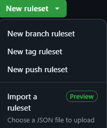

# CedMT-template-coding-projects <!-- omit in toc -->

***Template to coding projects that requires a conventional workflow***

<div align="center">

&nbsp;

[](./LICENSE)
[](./CODE_OF_CONDUCT.md)
[](https://semver.org/)

[](https://github.com/cedeirasf/CedMT-template-coding-projects/actions/workflows/labeling.yml)
[](https://github.com/cedeirasf/CedMT-template-coding-projects/actions/workflows/liberation.yml)
[](https://github.com/cedeirasf/CedMT-template-coding-projects/actions/workflows/project-automation.yml)

[Bug Report](./issues/new?assignees=&labels=bug%2Clifecycle%2Fneeds-triage&projects=cedeirasf%2F2&template=1-bug-report.yml&title=...+is+broken)
⭕
[Feature Request](./issues/new?assignees=&labels=enhancement%2Clifecycle%2Fneeds-triage&projects=cedeirasf%2F2&template=2-feature-request.yml&title=As+a+%5Btype+of+user%5D%2C+I+want+%5Ba+goal%5D+so+that+%5Bbenefit%5D)
⭕
[Help Wanted](./issues/new?assignees=&labels=help+wanted%2Clifecycle%2Fneeds-triage&projects=cedeirasf%2F2&template=3-help-wanted.yml&title=I+need+help+with...)

&nbsp;

</div>

- [✋ Introducción `CedMT-template-coding-projects`](#-introducción-cedmt-template-coding-projects)
- [❓ Cómo usar esta plantilla](#-cómo-usar-esta-plantilla)
- [🔥 Qué hacer después de usar `CedMT-template-coding-projects`](#-qué-hacer-después-de-usar-cedmt-template-coding-projects)
  - [1. Clonar el repositorio](#1-clonar-el-repositorio)
  - [2. Agregar el versionado inicial](#2-agregar-el-versionado-inicial)
  - [3. Configurar el repositorio en GitHub](#3-configurar-el-repositorio-en-github)
    - [Configuración de GitHub Actions](#configuración-de-github-actions)
    - [Agregar el secreto `GH_PROJECT_AUTOMATION`](#agregar-el-secreto-gh_project_automation)
    - [Proteger la rama `main`](#proteger-la-rama-main)
  - [4. Completar `.gitignore`](#4-completar-gitignore)
  - [5. Actualizar `CODEOWNERS`](#5-actualizar-codeowners)
  - [6. Actualizar `ISSUE_TEMPLATES`](#6-actualizar-issue_templates)
  - [7. Actualizar `pull_request_template`](#7-actualizar-pull_request_template)
  - [8. Configurar dependabot](#8-configurar-dependabot)
  - [9. Actualizar `LICENSE.md`](#9-actualizar-licensemd)
  - [10. Revisar `CODE_OF_CONDUCT.md`](#10-revisar-code_of_conductmd)
  - [11. Preparar los workflows](#11-preparar-los-workflows)
  - [12. Actualizar `README.md`](#12-actualizar-readmemd)
  - [13. Eliminar carpeta `Assets`](#13-eliminar-carpeta-assets)
- [Workflows](#workflows)
  - [CodeQL](#codeql)
  - [Tests](#tests)
  - [Labeling](#labeling)
  - [Liberation](#liberation)
  - [Project Automation](#project-automation)
  - [Deploy Release](#deploy-release)

&nbsp;

## ✋ Introducción `CedMT-template-coding-projects`

Este template contiene los elementos esenciales utilizados en varios proyectos de diferentes stacks.

- Incluye flujos de trabajo para manejar etiquetado, versionado, pruebas, liberación y despliegue.
- Contiene una licencia privada, una redacción básica de contribución y un código de conducta del pacto.
- Implementa una definición para generar notas de lanzamiento.
- Define plantillas para los tres tipos de problemas (bug, características, ayuda solicitada) y una plantilla de solicitud de extracción.
- Adicionalmente prepara un script de dependabot.
- Programa un análisis de CodeQL.
- E incluye CODEOWNERS

> [!WARNING]
> Muchos de los archivos de configuración en este repositorio no funcionarán apenas clone su proyecto ya que requieren que los configure de acuerdo a sus necesidades y objetivos. Debe prestar atención a las indicaciones posteriores para saber cómo hacerlo.

## ❓ Cómo usar esta plantilla

Para usar este template, haga clic en el botón **Use this template** que se muestra en la sección superior en la [raíz del repositorio](https://github.com/cedeirasf/CedMT-template-coding-projects), luego cree un nuevo repositorio.

Otra forma es iniciar el proceso de creación de un nuevo repositorio y seleccionar esta plantilla en la sección superior.

## 🔥 Qué hacer después de usar `CedMT-template-coding-projects`

Esta plantilla contiene muchos archivos. Muchos de ellos requieren atención especial. A continuación, se muestra una lista de tareas que probablemente necesitará realizar después de crear un nuevo repositorio basado en esta plantilla.

### 1. Clonar el repositorio

Una vez que haya creado un nuevo repositorio basado en esta plantilla, puede clonarlo en su máquina local y comenzar a configurarlo.

```bash
git clone <repo-url>
cd <repo-name>
```

### 2. Agregar el versionado inicial

Despues de clonar el nuevo repositorio creado a partir de esta plantilla, deberías crear una nueva etiqueta para la primera versión.

Este paso es importante porque el flujo de trabajo de liberación depende de la existencia de una etiqueta para funcionar correctamente.

Puedes hacerlo con los siguientes comandos:

```bash
git tag v1.0.0
git tag v1.0
git tag v1
git push --tags
```

> [!NOTE]
> Puede usar cualquier versión que desee. En este caso, se utilizó `v1.0.0`. Si desea usar una versión diferente, asegúrese de que sea compatible con [Semantic Versioning](https://semver.org/).

### 3. Configurar el repositorio en GitHub

Vaya a la sección de configuración de su repositorio en GitHub `Settings` y realice las siguientes configuraciones:

#### Configuración de GitHub Actions

Habilitar `Allow GitHub Actions to create and approve pull request` y seleccionar `Read and write permissions` en `Settings > Actions > General > Workflow Permissions`.

Este secreto es necesario para que el flujo de trabajo de automatización de proyectos funcione correctamente.


#### Agregar el secreto `GH_PROJECT_AUTOMATION`

Agregar el secreto `GH_PROJECT_AUTOMATION` en `Settings > Secrets and variables > Actions` con los siguientes permisos:

- [x] repo
  - [x] repo:status
  - [x] repo_deployment
  - [x] public_repo
  - [x] repo:invite
  - [x] security_events
- [x] admin:org
  - [x] write:org
  - [x] read:org
  - [x] manage_runners:org
- [x] project
  - [x] read:project

> [!NOTE]
> Lo más probable es que el token `GH_PROJECT_AUTOMATION` ya este creado, consulte con el PM del proyecto para obtenerlo.

#### Proteger la rama `main`

Proteger la rama `main` importando el archivo [./Assets/MainRules.json](./Assets/MainRules.json) en `Settings > Rules > Rulesets`.



> [!NOTE]
> Estas configuraciones pueden ser diferentes según sus necesidades. Las opciones que se muestran aquí son las adecuadas para el flujo de trabajo en el proyecto `CedMT`.
> Puede encontrar más información sobre cómo configurar estas opciones en la [documentación oficial de GitHub](https://docs.github.com/en/github/administering-a-repository/configuring-protected-branches).

### 4. Completar `.gitignore`

El archivo `.gitignore` debe contener una lista de archivos y directorios que se ignorarán en el control de versiones de Git. Este archivo se encuentra en la raíz del repositorio y debe completarse dependiendo de las necesidades de su proyecto.

### 5. Actualizar `CODEOWNERS`

El archivo `CODEOWNERS` contiene una lista de personas que son responsables de revisar el código en el repositorio. Debe actualizar este archivo con las personas adecuadas.

Por defecto, el archivo `CODEOWNERS` contiene el valor adecuado para cualquier repositorio del proyecto `CedMT`.

```plaintext
* @cedeirasf/CedMT
```

> [!NOTE]
> Encontrará más información sobre cómo configurar este archivo en la [documentación oficial de GitHub](https://docs.github.com/en/github/creating-cloning-and-archiving-repositories/about-code-owners).

### 6. Actualizar `ISSUE_TEMPLATES`

Las plantillas de problemas se encuentran en el directorio `.github/ISSUE_TEMPLATES`. Debe actualizar estas plantillas con la información adecuada para su proyecto.

Por defecto, las plantillas de problemas contienen el valor adecuado para cualquier repositorio del proyecto `CedMT`, includo el enlace al proyecto.

> [!NOTE]
> Encontrará más información sobre cómo configurar estas plantillas en la [documentación oficial de GitHub](https://docs.github.com/en/issues/tracking-your-work-with-issues/creating-issues/creating-an-issue-template-for-your-repository).

### 7. Actualizar `pull_request_template`

El archivo `pull_request_template.md` contiene una plantilla para solicitudes de extracción. Debe actualizar esta plantilla con la información adecuada para su proyecto.

Por defecto, la plantilla de solicitud de extracción contiene el valor adecuado para cualquier repositorio del proyecto `CedMT`.

> [!NOTE]
> Encontrará más información sobre cómo configurar esta plantilla en la [documentación oficial de GitHub](https://docs.github.com/en/github/collaborating-with-issues-and-pull-requests/creating-a-pull-request-template-for-your-repository).

### 8. Configurar dependabot

El archivo `.github/dependabot.yml` contiene la configuración de dependabot. Para más información sobre cómo configurar dependabot, consulte la [documentación oficial de GitHub](https://docs.github.com/en/code-security/supply-chain-security/keeping-your-dependencies-updated-automatically/configuration-options-for-dependency-updates).

### 9. Actualizar `LICENSE.md`

El archivo `LICENSE.md` contiene la licencia del proyecto. Puede eliminar el archivo actual para indicar que el proyecto no tiene licencia o puede reemplazarlo por una licencia diferente, por ejemplo [MIT](https://choosealicense.com/licenses/mit/).

> [!NOTE]
> Consultar con el PM del proyecto para saber qué licencia usar.

### 10. Revisar `CODE_OF_CONDUCT.md`

El archivo `CODE_OF_CONDUCT.md` contiene el código de conducta del proyecto. Si esta usando el código de conducta para otro proyecto, debe actualizar el email de contacto.

### 11. Preparar los workflows

Hay varios flujos de trabajo en este repositorio, algunos pueden ser eliminados si no son necesarios. Otros deben ser configurados para que funcionen correctamente. Dependerá de las necesidades de su proyecto.

Por lo general, para proyectos `.NET` o `Node.js`, el flujo de trabajo de pruebas es el más importante.

Flujos de trabajo como `dependabot` o `codeql` pueden ser eliminados si no son necesarios.

> [!NOTE]
> Consulte la sección de [Workflows](#workflows) para obtener más información sobre cómo configurar cada uno de ellos.

### 12. Actualizar `README.md`

El archivo `README.md` contiene información sobre el proyecto. Debe actualizar este archivo con la información adecuada para su proyecto.

- Replace title `CedMT-template-coding-projects` for the title in your repo.
- Update subtitle
- After edit workflows, update badgets on header section
- After edit ISSUE_TEMPLATES, update links on header section
- Remove sections that talk about template

- Reemplace el título `CedMT-template-coding-projects` por el título de su repositorio.
- Actualice el subtítulo
- Después de editar los flujos de trabajo, actualice los badgets en la sección del encabezado
- Después de editar ISSUE_TEMPLATES, actualice los enlaces en la sección del encabezado
- Elimine las secciones que hablan sobre la plantilla
- Redacte su propio contenido en el archivo `README.md`.

### 13. Eliminar carpeta `Assets` 

La carpeta `Assets` contiene diferentes configuraciones y archivos que una vez creado el proyecto, ya no son necesarios.

## Workflows

### CodeQL

`/.github/workflows/codeql-analysis.yml`

This file enables the CodeQL service provided by GitHub. You should provide a language supported.
If your project is not supported, I recommend removing this yaml file.

### Tests

`/.github/workflows/tests.yml`

This workflow is the most complex to configure. This depends highly on your stack and environment.
In some cases, you will probably need to split this workflow into unit and integration tests.
It only contains some steps with a simple message showing you the commands to configure a node test environment.

I recommend you study your case carefully.

### Labeling

`/.github/workflows/labeling.yml`

Include a PR labeling workflow caller. It consumes the reusable workflows stored in [cedeirasf/CedMT-devops-workflows](https://github.com/cedeirasf/CedMT-devops-workflows).

### Liberation

`/.github/workflows/liberation.yml`

The versioning workflow contains a caller to the reusable workflow stored in [cedeirasf/CedMT-devops-workflows](https://github.com/cedeirasf/CedMT-devops-workflows).

The `liberation` include a simple versioning and release without adds other artifacts. Is ideal to start, but in the most uses cases you would create your unique liberation flow.

We recommend you look how the [reusable liberation workflow works](https://github.com/cedeirasf/CedMT-devops-workflows/blob/main/.github/workflows/liberation.yml). You can find two reusable workflows that allows configure your liberation resources easily.

### Project Automation

`project-automation` consists in a simple workflow caller job to run [cedeirasf/CedMT-devops-workflows](https://github.com/cedeirasf/CedMT-devops-workflows).

For this workflows works correctly you need configure the secret `GH_PROJECT_AUTOMATION` with a **PAT token in classic mode**.

The PAT token must have permissions for:

- [x] repo
  - [x] repo:status
  - [x] repo_deployment
  - [x] public_repo
  - [x] repo:invite
  - [x] security_events
- [x] admin:org
  - [x] write:org
  - [x] read:org
  - [x] manage_runners:org
- [x] project
  - [x] read:project

### Deploy Release

This workflows is a simple demo of how setup a simple deploy release when a new release is published by `liberation` workflow.

For `deploy-release` was triggered is needed that `liberation` runs with a github token different that `secrets.GITHUB_TOKEN`.
